# Introduction
This document is intended for developers who will maintain or further develop the app. This will provide an overview of the project structure, the design patterns utilized and the rationale behind key structural decisions to ensure a consistent coding style.

# Technical Stack
The application is built using Android Studio
* Core Technologies:
*   Language: Kotlin by utilizing coroutines and flow for asynchronous data streams
*   UI Framework: Jetpack Compose 
*   Local Database: Room Persistence Library which is an abstraction layer over SQLite for local storage.
*   Networking: Ktor,Retrofit and OkHttp
* Serialization: Kotlinx Serialization which is used for parsing JSON data from APIs and the MCP server.

* Integrated Services & APIs:

| Service | Purpose |
| :--- | :--- |
| **MET MCP Server** | Model Context Protocol server providing weather and alert tools. |
| **Anthropic Claude API** | AI engine (Sonnet 3.5) for intelligent gardening advice. |
| **MapBox SDK** | Map visualization and geographic search (Geocoding). |
| **MET Frost API** | Access to historical weather observations (Precipitation). |
| **MET Locationforecast** | Detailed real-time and predictive weather data. |
| **MET Alerts** | Real-time weather hazard notifications (e.g., extreme weather). |

# Architecture 
This application is structured around a layered MVVM(Model-View-ViewModel) architecture, promoting a clean separation between the data infrastructure and the user interface.
The design and implementation are based on reccomended [Android "best practices"](https://developer.android.com/topic/architecture/recommendations). 

# OO Principles: High Cohesion and Low Coupling
By strictly separating responsibilities into four layers (Presentation, Domain, Data and Models), we achieve high cohesion within components and low coupling between layers.
* High Cohesion: Each component has a single, well-defined responsibilty.
  > Example: `PlantDataSource` class demonstrates high cohesion by focuing exclusively on loading and transforming plant data from a local CSV asset into domain specific `PlantInfo` objects. All methods within the class support this single responsibility, including parsing, normalization and mapping logic.
* Low Coupling: This application demonstrates low coupling through its MVVM-based architecture:
  * The UI layer (for example `LandingPageScreen` and `MapScreen`) only interacts with ViewModels and does not access data sources directly.
  * The ViewModels (for example `LandingPageViewModel`, `MapViewModel`) act as intermediaries and handle application logic while requesting data from repositories.
  > Example: `LandingPageScreen` does not directly access weather APIs or database queries. Instead it collects state from `LandingPageViewModel` which retrieves weather data through `MetWeatherRepository`.

### Unidirectional Data Flow (UDF)
The application strictly implements **Unidirectional Data Flow (UDF)** to manage the relationship between the UI and logic. In this pattern, state flows in only one direction:
* **State flows down:** ViewModels expose application state via `StateFlow` (e.g., `selectedLocation`). Every Composable reads this state to render the interface but never mutates it directly.
* **Events flow up:** When a user interacts with the UI, such as selecting a location or saving a plant, the Composable triggers an "intent" function within the ViewModel.
* **Single Source of Truth:** The ViewModel processes the intent (often updating a Repository or Database) and updates the `StateFlow`. This change automatically triggers a recomposition in Jetpack Compose. This ensures that the UI always mirrors the current data without manual synchronization, significantly reducing bugs related to inconsistent state across different screens.

## API-Levels
* **Minimum SDK: 33**
* **Target SDK: 36**
  
Initially, the project aimed for a lower minimum SDK such as 26, but we made the decision to raise it to 33. While a lower SDK would technically support more devices, this decision was made for the implementation of our reverse geocoding logic in the `getAdress` function in `MapViewModel`. Geocoder.getFromLocation() is a function that requires this minimum level ([Android Developers](https://developer.android.com/reference/android/location/Geocoder)). The function is used to retrieve an address from coordinates, which is required to be able to save the coordinates from the user's live location. The target SDK is set to 36, which is higher than Google Play's requirement of API 35 for newer apps. This ensures that the app is compatible with the latest versions of Android ([Google](https://support.google.com/googleplay/android-developer/answer/11926878)).

## Architecture drawing

```mermaid
  graph TD
  
    MA[MainActivity]
    %% UI LAYER
    subgraph UI ["1. UI & Navigation (Presentation)"]
        direction TB
        Nav[AppNavHost]
        
        subgraph VMs ["ViewModels (State Management)"]
            MPVM[MyPlantsViewModel]
            LVM[LandingPageViewModel]
            MVM[MapViewModel]
            LocVM[LocationsViewModel]
            FVM[FindPlantsViewModel]
            PDVM[PlantDetailViewModel]
        end
        subgraph Screens ["Screens (UI)"]
            LandingS[LandingPageScreen]
            MapS[MapScreen]
            MyS[MyPlantsScreen]
            FindS[FindPlantScreen]
            DetailS[PlantDetailScreen]
        end
        subgraph Components ["UI Components"]
            PIC[PlantInfoCard]
            DTC[DailyTasksCard]
            SLD[SwitchLocationDialog]
            PC[PlantCard]
            SPC[SimplePlantCard]
            WC[WeatherCard]
        end
    end
    %% DOMAIN LAYER
    subgraph Domain ["2. Domain Layer "]
        direction TB
        LocRepo[LocationRepository]
        AiRepo[HybridAiRepository]
        PlantRepo[PlantRepository]
        MetRepo[MetWeatherRepository]
        FrostRepo[FrostRepository]
    end
    %% DATA LAYER
    subgraph Data ["3. Data Layer (Infrastructure)"]
        direction TB
        subgraph Remote ["Remote Data Sources"]
            FrostDS[FrostDataSource]
            PlantDS[PlantDataSource]
            MetClient[MetMcpClient]
            ClaudeApi[ClaudeAPI]
        end
        
        subgraph Local ["Local Data (Room)"]
            DB[Room Database]
            SDao["&laquo;interface&raquo;<br/>SavedLocationDao"]
            PDao["&laquo;interface&raquo;<br/>SavedPlantDao"]
            ConnObs[ConnectivityObserver]
        end
    end
    %% MODELS
    subgraph Models ["4. Models & Data Classes"]
        direction TB
        subgraph Entities ["Room Entities"]
            SL[SavedLocation]
            SP[SavedPlant]
        end
        subgraph AiModels ["AI & Response Models"]
            CReq[ClaudeRequest]
            CRes[ClaudeResponse]
            AR[AiRecommendationResponse]
            PA[PlantAdvice]
            PD[PropertyDefinition]
        end
        subgraph ClientModels ["Client Models (MCP/API)"]
            McpModels[MetMcpDataModels]
            WF[WeatherForecast]
            WA[WeatherAlert]
        end
    end
    %% RELATIONSHIPS
    %% MainActivity Setup
    MA --> Nav
    MA --> LocVM
    MA --> MPVM
    MA --> LVM
    MA --> PDVM
    MA --> ConnObs
    %% Navigation Flow
    Nav --> LandingS
    Nav --> MapS
    Nav --> MyS
    Nav --> FindS
    Nav --> DetailS
    Nav --> MPVM
    Nav --> LVM
    %% Screen logic
    LandingS -.-> LVM
    LandingS -.-> MPVM
    LandingS -.-> DTC
    LandingS -.-> PIC
    LandingS -.-> WC
    
    MyS -.-> MPVM
    MyS -.-> PC
    MyS -.-> PIC
    
    MapS -.-> MVM
    
    FindS -.-> FVM
    FindS -.-> SPC
    
    DetailS -.-> PDVM
    %% ViewModel to Domain access
    VMs -.-> Domain
    AiRepo -.-> LocRepo
    AiRepo -.-> MetRepo
    %% Repository to Data Source flow
    PlantRepo --> PlantDS
    LocRepo --> SDao
    LocRepo --> PDao
    FrostRepo --> FrostDS
    MetRepo --> MetClient
    AiRepo --> ClaudeApi
    
    %% Database Interaction
    SDao --> SL
    PDao --> SP
    DB --> SDao
    DB --> PDao
    %% Model & Entity usage
    SL -.-> Domain
    SL -.-> VMs
    SL -.-> PIC
    SL -.-> DTC
    
    McpModels -.-> MetClient
    McpModels -.-> MetRepo
    
    %% Weather Model Flow
    WF -.-> MetRepo
    WA -.-> MetRepo
    WF -.-> LVM
    WA -.-> LVM
    WA -.-> MVM
    
    AiModels -.-> VMs
    ClientModels -.-> VMs
```

 

## Warnings in the code
### build.gradle.kts, line 17
  - "Not targeting the latest versions of Android; compatibility modes apply. Consider testing and updating this version. Consult the `android.os.Build.VERSION_CODES` javadoc for details."

Android 17 (API level 37) is indeed out, but the release is still in beta. We decided to keep it to 36 because that is the latest stable release, as per Android's documentation: https://developer.android.com/tools/releases/platforms and https://developer.android.com/tools/releases/platform-tools (as per May 2026).

### ClaudeModels.txt, line 17, 44, 53 and 76
- Property name 'max_tokens' should not contain underscores
- Property name 'tool_use_id' should not contain underscores
- Property name 'input_schema' should not contain underscores
- Property name 'stop_reason' should not contain underscores

When we tried to change the properties to maxTokens, toolUseId, etc., the AI stopped returning responses. We found out that this is because Anthropic API strictly requires the variable names to have underscores, and it won't recognize the variables if it's in the typical Kotlin format with uppercase letters. These names must match the JSON keys the Anthropic API expects exactly, since kotlinx.serialization uses the Kotlin property name directly as the JSON key when serializing.

## Known Technial debt/Improvements  
We have some technical debt such as some larger screens like LandingPageScreen currently relying on multiple ViewModels. Future developers may consider consolidating these into a single state holder to further reduce coupling. 

Currently, the application utilizes a CSV file to store and retrieve data. While this approach is sufficient for a limited number of plants, this introduces some technical debt regarding scalability and performance. Reading a large CSV file into memory as a list of objects can lead to high RAM usage, potentially causing out of memory error if we decide to add a large amount of new plants. To solve this technical debt, the plant data should be migrated from the CSV format into a database. 

Another technical debt is that we are using`FallBackToDestructiveMigration` in our Room database. In production code this could not be used because all data is wiped from the Database when updated. The solution would be to use `AutoMigration`.

## Maintenance guide
* Adding Images: Be aware that adding new images to the drawable folder may change resource IDs, which currently requires a database wipe due to destructive migrations.

* Testing: Use MockK for unit testing, especially when simulating malformed JSON from the AI engine.

