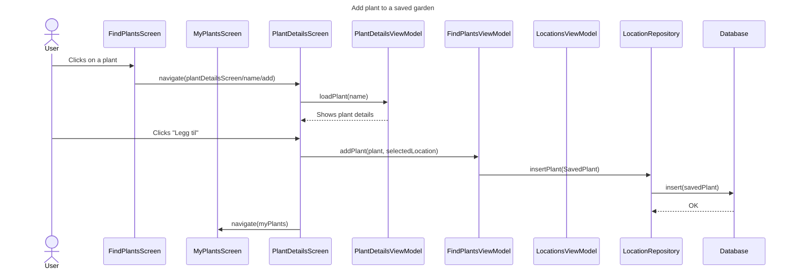
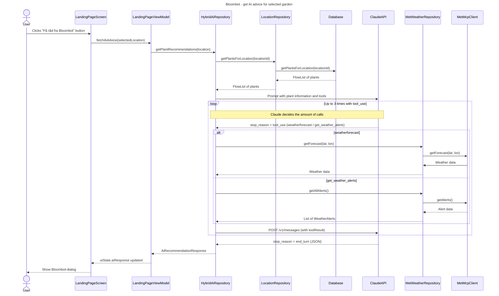

## Sequence diagram

## Sequence diagram

## Use case diagram

## Class diagram

```mermaid
---
title: Bloombot - get AI advice for selected garden
---

classDiagram-v2



class SavedLocation {
    <<model.location>>
    Long id
    String name
    Double lat
    Double lon
    String address
    Int zone
}

class SavedPlant {
    Long id
    Long locationId
    String name
    Set~SoilType~ soil
    Set~LightType~ light
    Float waterPerWeek
    Set~Int~ plantingMonth
    Int climateZone
    Boolean hasBeenWatered
    Int daysSinceWatered
    Int maxDaysWithoutWater
    Int imageRes
    String description
    Long lastWateredDate
    Long lastFertilizationDate
}
class PlantInfo {
    String name
    Set~SoilType~ soil
    Set~LightType~ light
    Float waterPerWeek
    Set~Int~ plantingMonth
    Int climateZone
    Boolean hasBeenWatered
    Int daysSinceWatered
    Int maxDaysWithoutWater
    Int imageRes
    String description
}

class FrostDataSource{
    getNearestStation(lat: Double, lon: Double, clientId: String): Source
    getPrecipitationSinceLastUsed(
    lat: Double,
    lon: Double,
    clientId: String,
    lastWatered: String
): Map<String, Double>
}

class WeatherForecast {
    <<data.mcp>>
}

class WeatherAlert {
    <<data.mcp>>
    Color color
    Boolean isDangerousForPlant(Boolean)
}

class WeatherUiState {
    <<ui.landingpage>>
    String temperature
    String precipitation
    String description
    String iconName
}

class LandingPageUiState {
    <<ui.landingpage>>
    +Map~Long,WeatherUiState~ locationForecasts
    +Boolean isWeatherLoading
    +Map~Long,List~WeatherAlert~~ locationAlerts
    +Boolean isAlertsLoading
    +AiRecommendationResponse? aiResponse
    +Boolean isAiLoading
    +Boolean showInfoDialog
}
class MapUiState {
    <<ui.map>>
    +Double centerLng
    +Double centerLat
    +Double zoom
    +String searchQuery
    +List~SearchSuggestion~ suggestions
    +List~WeatherAlert~ weatherAlerts
    +List~WeatherAlert~ locationAlerts
    +Boolean isAlertLoading
    +Double? userLat
    +Double? userLon
    +Boolean liveLocationPending
    +Boolean showLiveLocationConfirm
    +Boolean isSaving
}

class SoilType {
    <<enumeration>>
    SOIL
    CHALK
    CLAY
    LOAM
    SAND
}

class LightType {
    <<enumeration>>
    SHADE
    PARTIAL
    FULL
}

class SavedLocationDao {
    <<interface>>
    insert(SavedLocation)
    delete(SavedLocation)
    update(SavedLocation)
    getAllLocations() : Flow~List~SavedLocation
}
SavedLocation --> SavedLocationDao
class SavedPlantDao {
    <<interface>>
    insert(SavedPlant) : Long
    delete(SavedPlant)
    update(SavedPlant)
    getPlantsForLocation(Long) : +Flow~List~SavedPlant
    getAllPlants() : +Flow~List~SavedPlant
}


class AppDatabase {
    <<abstract>>
    +SavedLocationDao savedLocationDao()
    +SavedPlantDao savedPlantDao()
    +AppDatabase getDatabase(Context)$
}


class LocationRepository {
    +Flow~List~SavedLocation~~ allLocations
    insertLocation(SavedLocation) : Long
    deleteLocation(SavedLocation)
    updateLocation(SavedLocation)
    insertPlant(SavedPlant)
    deletePlant(SavedPlant)
    updatePlant(SavedPlant)
    getPlantsForLocation(Long) : Flow~List~SavedPlant~~
    getAllPlants() : Flow~List~SavedPlant~~
}


class PlantRepository {
        initiatePlants() : List~PlantInfo~
        recommendPlants(SavedLocation, List~SavedPlant~) : List~PlantInfo~
        notRecommendedPlants(SavedLocation, List~SavedPlant~) : List~PlantInfo~
    }

class PlantDataSource {
    fetchPlants() : List~PlantInfo~ 
    mapToPlant(List~String~) : Private PlantInfo
    normalizeName(String) : Private String
}



class ClaudeApi {
    <<interface>>
    sendMessage(String, ClaudeRequest) : ClaudeResponse 
}

class HybridAiRepository {
    -MODEL_NAME$
    -MAX_TOOL_LOOPS$
    -TOOL_NAME_WEATHER_FORECAST$
    -TOOL_NAME_WEATHER_ALERTS$
    +List~SavedPlant~ getPlantData(SavedLocation, LocationRepository)
    +String getPlantTxt(SavedLocation, LocationRepository)
    +AiRecommendationResponse getPlantRecommendations(SavedLocation)
    +AiRecommendationResponse getFuturePlantRecommendations(SavedLocation)
}



class MetMcpClient {
    connect()
    getForecast(Double, Double) : String
    getAlerts() : String
}
class MetWeatherRepository {
        getForecast(Double, Double) : String
        getParsedForecast(String) : WeatherForecast
        getAllAlerts() : List~WeatherAlert~
        parseAlerts(String) : List~WeatherAlert~
        isPointInPolygon(Double, Double, List) : Boolean
    }






class FrostRepository {
    +Map~String, Double~ getPrecipitationSinceLastUsed(Double, Double, String)
}

class LocationsViewModel {
        StateFlow~List~SavedLocation~~ savedLocations
        StateFlow~SavedLocation~ selectedLocation
        StateFlow~Boolean~ showMaxLocationsDialog
        selectLocation(SavedLocation)
        updateSelectedLocationName(String)
        onAddLocationClicked() : Boolean
        dismissMaxLocationsDialog()
    }


class MainActivity {
    onCreate()
}

class FindPlantsViewModel {
    StateFlow~List~PlantDetails~~ plants
    StateFlow~List~PlantDetails~~ notRecommendedPlants
    addPlant(PlantDetails, SavdLocation)
    loadRecommendedPlants(SavedLocation)
    clearPlants()
}



class SavedPlacesViewModel {
    +StateFlow~List~SavedLocation~~ savedLocations
    +StateFlow~SavedLocation~ selectedLocation
    +StateFlow~Boolean~ showMaxLocationsDialog
    +void selectLocation(SavedLocation)
    +void addLocation(SavedLocation)
    +void updateLocation(SavedLocation)
    +void updateSelectedLocationName(String)
    +Boolean onAddLocationClicked()
    +void dismissMaxLocationsDialog()
}


class LandingPageViewModel {
    StateFlow~LandingPageUiState~ uiState
    fetchAiAdvice(SavedLocation)
    fetchFutureAiAdvice(SavedLocation)
    dismissAiAdvice()
    showInfoDialog()
    dismissInfoDialog()
    loadDataForLocations(List~SavedLocation~)
}



class MapViewModel {
    StateFlow~MapUiState~ uiState
    updateUserPosition(Double, Double)
    requestLiveLocationSave()
    String getAddress(Double, Double, Context) : String
    confirmSaveLiveLocation(Context)
    dismissLiveLocationConfirm()
    onLocationReady()
    fetchAlerts(Double, Double)
    onSearchQueryChanged(String)
    handleSuggestionSelection(SearchSuggestion)
    onMapReady(MapboxMap)
    getClimateZone(Double, Double) : Int
    confirmSavePlace()
    onSavedLocationClicked(SavedLocation)
    dismissSavedDialog()
}



class PlantDetailsViewModel {
    StateFlow~PlantDetails~ plant
    loadPlant(String)
    loadSavedPlant(String, List~SavedPlant~)
}






class MyPlantsViewModel {
    StateFlow~List~SavedPlant~~ plants
    StateFlow~List~SavedPlant~~ allPlants
    removePlantByName(String)
    markAsWatered(SavedPlant)
    needsWater(SavedPlant) : Boolean
    daysUntilWatering(SavedPlant) : Long
    daysSinceFertilizing(SavedPlant) : Long
    markAsFertilized(SavedPlant)
    deleteLocation(SavedLocation)
    renameLocation(SavedLocation, String)
    getWateringText(SavedPlant) : String 
    loadPrecipitationForLocation(Double, Double)
    getPlantsNeedingWaterByLocation(List~SavedLocation~) : Flow~Map~SavedLocation, List~Pair~SavedPlant, String~~~~
}





%% MainActivity → ViewModels
MainActivity --> LandingPageViewModel
MainActivity --> MapViewModel
MainActivity --> LocationsViewModel
MainActivity --> SavedPlacesViewModel
MainActivity --> FindPlantsViewModel
MainActivity --> MyPlantsViewModel
MainActivity --> PlantDetailsViewModel

%% ViewModels → Repositories
LandingPageViewModel --> MetWeatherRepository
LandingPageViewModel --> HybridAiRepository
LandingPageViewModel ..> LandingPageUiState : produces
MapViewModel --> MetWeatherRepository
MapViewModel --> LocationRepository
MapViewModel ..> MapUiState : produces
LocationsViewModel --> LocationRepository
LocationsViewModel --> SavedLocation
SavedPlacesViewModel --> LocationRepository
FindPlantsViewModel --> PlantRepository
FindPlantsViewModel --> LocationRepository
FindPlantsViewModel --> PlantDetails
MyPlantsViewModel --> LocationRepository
MyPlantsViewModel --> FrostRepository
MyPlantsViewModel --> LocationsViewModel
MyPlantsViewModel --> SavedPlant
PlantDetailsViewModel --> PlantRepository
PlantDetailsViewModel --> PlantDetails

%% Repositories → DataSources
LocationRepository --> SavedLocationDao
LocationRepository --> SavedPlantDao
PlantRepository --> PlantDataSource
FrostRepository --> FrostDataSource
MetWeatherRepository --> MetMcpClient
HybridAiRepository --> ClaudeApi
HybridAiRepository --> MetWeatherRepository
HybridAiRepository --> MetMcpClient
HybridAiRepository --> LocationRepository

%% DataSources → Database
AppDatabase "1" *-- "1" SavedLocationDao
AppDatabase "1" *-- "1" SavedPlantDao
SavedLocationDao --> SavedLocation

%% Repository → Models
MetWeatherRepository --> WeatherForecast
MetWeatherRepository --> WeatherAlert
PlantDataSource --> PlantInfo
PlantRepository --> PlantInfo

%% UI State
LandingPageUiState --> WeatherUiState
LandingPageUiState --> WeatherAlert

%% Model-relasjoner
SavedPlant --> SavedLocation : locationId (FK)
SavedPlant ..> SoilType : uses
SavedPlant ..> LightType : uses
PlantInfo ..> SoilType : uses
PlantInfo ..> LightType : uses
PlantDetails ..> SoilType : uses
PlantDetails ..> LightType : uses
```

## Activity diagram

- Pre-condition: User opens the app.

- Post-condition: The watering state of the plants is updated in the database, and the UI correctly reflects whether they require attention on the Home Screen.

Main Flow: 

1. The system checks if the user has a saved garden and plants.

2. The system fetches the plants' watering needs and requests historical weather data (precipitation) from the MET Frost API.

3. The weather data shows that it has rained enough (above the specific millimeter threshold) since the last watering date.

4. The system automatically registers the plant as watered.

5. The Home Screen is displayed, and the plant is omitted from the "Daily Tasks" list.

5. The action is completed.

Alternative Flow: 

3.1 The weather data shows that it has not rained enough.

3.2 The system checks if the plant has already been manually registered as watered by the user.

3.3 The plant has not been watered manually.

3.4 The system adds the plant to the user's "Daily Tasks" list on the Home Screen.

3.5 The Home Screen is displayed, prompting the user for action.

```mermaid

---
config:
  layout: dagre
---
flowchart TB
    %% Her defineres n1 og n2 som rene sirkler direkte i flyten
    n1(( )) --> Start
    End --> n2(( ))

    Start(["User opens app"]) --> CheckData{"Has user saved<br>garden and plants?"}
    CheckData -- No --> Idle(["App waits for user<br>to add content"])
    CheckData -- Yes --> FetchData["Fetch watering needs from Database<br>&amp; check weather data (MET)"]
    FetchData --> RainCheck{"Has it rained enough<br>(above specific mm)?"}
    RainCheck -- Yes --> SkipTask["Register as watered"]
    RainCheck -- No --> WaterCheck{"Is plant already<br>watered manually?"}
    WaterCheck -- Yes --> SkipTask
    WaterCheck -- No --> AddToDaily@{ label: "Add plant to<br>'Daily Tasks'" }
    SkipTask --> DisplayHome["Display Home Screen"]
    AddToDaily --> DisplayHome
    DisplayHome --> UserAction{"How will user<br>register watering?"}
    UserAction -- Shortcut (Home Screen) --> ClickDailyCard["Clicks plant in<br>Daily Tasks"]
    UserAction -- Navigation route --> NavMyPlaces@{ label: "Navigates to 'My Places'" }
    NavMyPlaces --> ClickGarden["Selects a specific garden"]
    ClickGarden --> ClickPlantProfile@{ label: "Opens the plant's card" }
    ClickPlantProfile --> ClickWaterButton@{ label: "Clicks 'I have watered' button" }
    ClickDailyCard --> ExecuteWatering["System registers action"]
    ClickWaterButton --> ExecuteWatering
    ExecuteWatering --> UpdateDB@{ label: "Updates local database:<br>Sets new 'lastWatered' date" }
    UpdateDB --> UpdateUI["UI updates:<br>Plant removed from Daily Tasks"]
    UpdateUI --> End(["Action completed"])

    AddToDaily@{ shape: rect}
    NavMyPlaces@{ shape: rect}
    ClickPlantProfile@{ shape: rect}
    ClickWaterButton@{ shape: rect}
    UpdateDB@{ shape: cylinder}

    %% Styling
    Start:::startEnd
    CheckData:::decision
    Idle:::startEnd
    RainCheck:::decision
    WaterCheck:::decision
    UserAction:::decision
    UpdateDB:::database
    End:::startEnd
    
    %% Gir start- og sluttsirklene den samme mørke fargen som Start/End-knappene
    n1:::startEnd
    n2:::startEnd

    classDef startEnd fill:#333,stroke:#333,stroke-width:2px,color:#fff
    classDef decision fill:#f9d0c4,stroke:#e88a73,stroke-width:2px,color:#000
    classDef database fill:#d4e6f1,stroke:#5dade2,stroke-width:2px,color:#000

```

